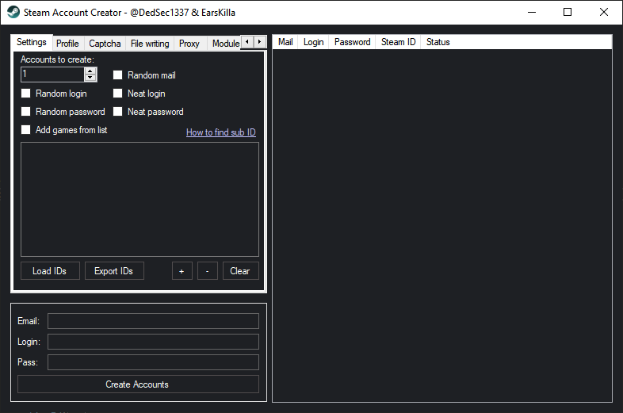

# Steam Account Generator

Web generator: https://accgen.cathook.club/ 

|Branch|CI status|
|------|---------|
|[MASTER](https://github.com/steam-account-creator/Steam-Account-Generator/tree/master)||
|[DEV](https://github.com/steam-account-creator/Steam-Account-Generator/tree/dev)||

  
More screenshots [here](etc/app_screenshots/INDEX.md)

Mass Steam Account generator features:
- [x] Automatically generate and verify email
  - [x] Custom email domain ([How to do this](https://github.com/steam-account-creator/Steam-Account-Generator/wiki/Using-custom-mail-domain))
  - [x] Custom email handler by implementing your own module
- [x] Automatically generate username
- [x] Automatically generate password
- [x] Resolve Steam ID of created account
- [x] Automatically disable Steam guard  
  **Note:** Only with atomatically email confirmation, otherwise waiting for your confirmation.  
  ⚠ At this moment not possible to check for user mail confirmation.
- [x] Update profile info
  - Name
  - Real name
  - Bio
  - Profile image
  - Location (country, city, etc)
  - Set url with your username (like this: `https://steamcommunity.com/id/<username>`)
- [x] Automatically join to groups
- [x] Automatically add free games to account
  - [x] Export/import this list  
    **Note:** [How to find sub ID](https://github.com/steam-account-creator/Steam-Account-Generator/wiki/Find-sub-ID)
- [x] Automatically save to text file
  - Can save accounts in CSV format and it can be imported for example in KeePass
- [x] Manual and automatically captcha services:
  - Captchasolutions
  - 2Captcha/RuCaptcha
  - **Note:** You can replace hosts of automatically captcha services ([here is how to do this](https://github.com/steam-account-creator/Steam-Account-Generator/releases/tag/v1.1.2-pre3))
  - You can implement your own module and solve using custom service
- [x] Proxy support
  - [x] Multiple proxies are supported  
It will work with http/https/socks4/socks5
- [x] Save most settings in JSON file.

# Download
[Steam-Account-Generator/releases](https://github.com/steam-account-creator/Steam-Account-Generator/releases)

# Requirements
- [.NET Framework 4.7.2](https://dotnet.microsoft.com/download/dotnet-framework-runtime/net472)
- [Visual C++ Redistributable for Visual Studio 2015](https://www.microsoft.com/en-us/download/details.aspx?id=48145)  
  This link will download x86 and x64 versions. You need to install both of them.

# Communication
🇫 Discord was died.  
- [Telegram](https://t.me/joinchat/KlzcPlIIzac3vF3ZjC2SrA)  
  **Note:** [Secondary link](https://onem3.cf/sac/) | GitHub hosted page  
  This is alternative for those who was born in country with "good" government (like me)
---
- Read [F.A.Q.](https://github.com/steam-account-creator/Steam-Account-Generator/wiki/F.A.Q.)
- Look [Issues](https://github.com/steam-account-creator/Steam-Account-Generator/issues)
  - If you're still having issue that not solved or solution not found in places above. You can:
    - Ask for it in telegram chat (you will see link in [communication](#communication) part)
    - Create new issue
